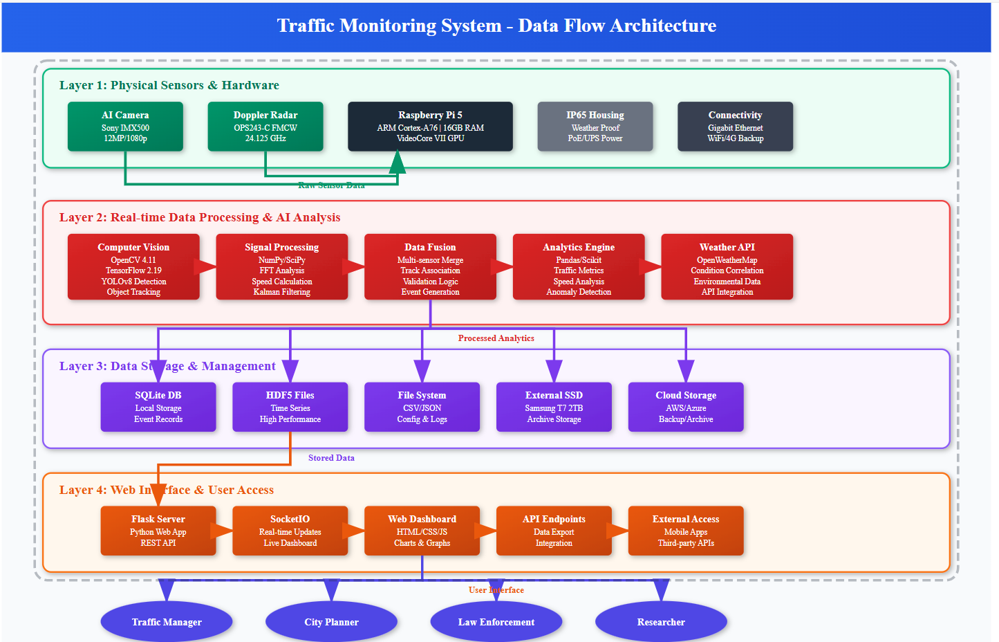

# Project Management Summary

**Document Version:** 1.0  
**Last Updated:** August 7, 2025  
**Project:** Raspberry Pi 5 Edge ML Traffic Monitoring System  
**Authors:** Project Team  

## Table of Contents

1. [Executive Summary](#executive-summary)
2. [Implementation Timeline](#1-implementation-timeline)
3. [Budget & Cost Estimates](#2-budget--cost-estimates)
4. [Risk Management Matrix](#3-risk-management-matrix--contingency-planning)
5. [Quality Assurance & Testing Protocols](#4-quality-assurance--testing-protocols)
6. [Architectural Design Comparison](#architectural-design-comparison)

**See also:**

- [Technical Design Document](./Technical_Design.md)
- [Implementation & Deployment Guide](./Implementation_Deployment.md)
- [User Guide](./User_Guide.md)
- [References & Appendices](./References_Appendices.md)

## Executive Summary

The Raspberry Pi 5 Edge ML Traffic Monitoring System is a comprehensive, edge-based solution for real-time vehicle detection, speed measurement, and traffic analytics. Leveraging a Raspberry Pi 5, AI-enabled camera, and radar sensor, the system processes data locally to reduce bandwidth, enhance privacy, and enable rapid response to traffic events. This documentation provides a clear roadmap for implementation, risk management, and quality assurance, ensuring the project is delivered on time, robustly tested, and aligned with best practices for smart city and transportation applications.

## 1. Implementation Timeline

Below is a milestone-based implementation timeline for the Raspberry Pi 5 Edge ML Traffic Monitoring System. Actual dates may vary based on project scope and resource availability.

| Milestone | Description & Sub-Tasks | Target Completion |
|-----------|-------------------------|------------------|
| Project Planning | Define requirements, select hardware, finalize architecture, identify MVP, create detailed task lists | Week 1 |
| Hardware Setup | Assemble Raspberry Pi, camera, radar sensor, storage; verify hardware; allocate buffer for hardware issues | Week 2 |
| Software Environment | Install OS, Python, dependencies, database; set up version control; test environment; buffer for integration issues | Week 2 |
| Core Development | Implement vehicle detection, radar integration, data fusion; frequent testing; break into sub-tasks (e.g., camera, radar, fusion); prioritize MVP features | Weeks 3-4 |
| Dashboard & API | Develop Edge UI, REST/WebSocket APIs, Cloud UI (if needed); incremental delivery; buffer for UI/API blockers | Weeks 5-6 |
| Testing & Validation | System integration, field testing, bug fixes, contingency for simulated data if sensors unavailable; regular backups | Weeks 7-8 |
| Documentation | Prepare technical docs, user guide, deployment instructions; update as features evolve; buffer for review | Week 8 |
| Final Review & Deployment | Final QA, stakeholder review, production deployment, contingency for last-minute issues | Week 9 |

**Iterative Development & MVP:**
This project follows an agile, milestone-based approach. The initial focus is on delivering a Minimal Viable Product (MVP) with core features, followed by iterative improvements based on feedback and testing. Each milestone includes buffer time for unforeseen issues and is broken into actionable sub-tasks to ensure steady progress and risk mitigation.

**Note:** For a visual Gantt chart, use project management tools like Trello, Asana, or GanttProject.

## 2. Budget & Cost Estimates

### Hardware Costs (Per Unit)

| Component | Model/Description | Unit Cost (USD) | Quantity | Total Cost |
|-----------|-------------------|----------------|----------|------------|
| Raspberry Pi 5 | CanaKit Raspberry Pi 5 Starter Kit MAX - Turbine White (256 GB Edition) (16GB RAM) | $120 | 1 | $219 |
| AI Camera | Sony IMX500 (Raspberry Pi AI Camera) | $70 | 1 | $70 |
| AI Camera extended cable | Official CSI FPC Flexible Cable Compatible with Raspberry Pi 5, 22Pin to 15Pin, Suitable for CSI Camera Modules, 500MM/50CM/1.64 FT | $9.79 | 1 | $9.79 |
| Radar Sensor | OmniPreSense OPS243-C | $255 | 1 | $255 |
| Storage | Samsung T7 Shield 2TB, Portable SSD, up-to 1050MB/s, USB 3.2 Gen2, Rugged,IP65 Water & Dust Resistant, Extenal Solid State Drive (MU-PE2T0S/AM), Black | $149 | 1 | $149 |
| MicroSD Card Extender | LANMU Micro SD to Micro SD Card Extension Cable Adapter Flexible Extender Compatible with Ender 3 Pro/Ender 3/Ender 3 V2/Ender 5 Plus/Ender 5 Pro/CR-10S Pro/Raspberry Pi(5.9in/15cm) | $5.99 | 1 | $5.99 |
| Power Supply | DC 12V/24V to 5V 15A Step Down Converter - Voltage Regulator Buck Converter Power Supply Transformer | $10.99 | 1 | $10.99 |
| USB Power Supply | DC 12V/24V to 5V USB C Step Down Converter Type-C Interface 5A 25W Waterproof Buck Module Power Adapter Compatible with Raspberry Pi 4, Cell Phones 1-Pack | $9.99 | 1 | $9.99 |
| Main power adapter | 24V DC Power Adapter Doorbell Transformer for C WireThermostat,Heywell Nest,Ring Pro doorbell,Ring Wired doorbell,Wyze Video Doorbell,24V LED Strip Light,Comes with CH-2 Connector, Cord 19.6FT Black | $15.99 | 1 | $15.99 |
| Ethernet cable | adaol Cat 6 Ethernet Cable 100 ft, Outdoor & Indoor 10Gbps Support Cat8 Cat7 Network, Flat RJ45 Internet LAN Computer Patch Cable for Router, Modem, Switch, Gaming Consoles, Streaming Devices, White | $16.14 | 1 | $16.14 |
| Enclosure | Junction Box, IP67 Waterproof Plastic Enclosure for Electrical Project, Hinged Grey Cover, Includes Mounting Plate and Wall Bracket 290×190×140mm (11.4"×7.5"×5.5") | $24.99 | 1 | $24.99 |
| Mounting Hardware | Pole/wall mount and assorted hardware | $50 | 1 | $50 |
| **Hardware Subtotal** | | | | **$804.89** |

### Software & Development Costs

| Category | Description | Cost (USD) |
|----------|-------------|------------|
| Software Licenses | Open source (PostgreSQL, Python, TensorFlow) | $0 |
| Cloud Services | Optional cloud hosting (monthly) | $20-50 |
| Development Tools | VS Code, Git, testing tools | $0 |
| **Software Subtotal** | | **$0-50** |

### Implementation & Deployment Costs

| Activity | Description | Hours | Rate | Total Cost |
|----------|-------------|-------|------|------------|
| System Integration | Hardware assembly and configuration | 8 | $75 | $600 |
| Software Deployment | OS setup, application installation | 4 | $75 | $300 |
| Testing & Validation | Field testing and calibration | 6 | $75 | $450 |
| Documentation | User training and documentation | 4 | $75 | $300 |
| **Implementation Subtotal** | | | | **$1,650** |


### Total Project Cost

- **Per Unit Hardware:** $804.89
- **Implementation (One-time):** $1,650
- **Monthly Operating:** $20-50 (if using cloud services)
- **Total First Unit:** $2,454.89 + monthly costs

*Note: Costs may vary based on supplier, location, and bulk purchasing agreements.*

## 3. Risk Management Matrix & Contingency Planning

| Risk | Impact | Likelihood | Mitigation Strategy | Monitoring/Alerting | Contingency Plan |
|------|--------|------------|---------------------|---------------------|------------------|
| Hardware failure (Pi, camera, radar) | High | Medium | Use quality components, keep spares | Health indicators, system logs | Allocate buffer time, keep spare parts, simulate data if needed |
| Data loss (storage failure) | High | Low | Regular backups, use SSD, monitor storage | Storage usage alerts, backup logs | Restore from backup, rollback to last known good state |
| ML model inaccuracy | Medium | Medium | Diverse training data, real-world validation | Model performance metrics | Retrain model, fallback to previous version |
| Network outage | Medium | Medium | Offline-first design, local storage | Network status monitoring | Operate in offline mode, auto-reconnect logic |
| Power loss | High | Low | UPS or PoE with backup, monitor power | Power status alerts | Resume on power restore, buffer for downtime |
| Security breach (API, dashboard) | High | Low | Auth, HTTPS, updates, firewall | Security logs, intrusion detection | Revoke credentials, patch vulnerabilities |
| Integration bugs (sensor fusion, API) | Medium | Medium | Incremental testing, code reviews | Automated test results, error logs | Isolate faulty module, use simulated data |
| Regulatory/compliance issues | Medium | Low | Review laws, anonymize data | Compliance checklist | Remove/modify non-compliant features |

**Contingency Planning:**

- Prioritize core MVP features to ensure essential delivery if time is tight
- Allocate buffer time in each milestone for unforeseen issues
- Plan regular backups and use version control for rollback
- Use simulated data if live sensor data is unavailable
- Monitor for hardware, network, and security risks with alerts

---

## 4. Quality Assurance & Testing Protocols

### Testing Protocols

- Break down development into small, testable sub-tasks for each milestone
- Perform frequent, incremental testing during development (unit, integration, system)
- Use automated tests and code reviews to catch issues early
- Track blockers and issues in a project management tool
- Validate MVP features first, then expand to additional features

### ML/AI Evaluation Metrics

- Track model accuracy, precision, recall, and real-world performance
- Use field testing feedback to improve models

### Documentation & Review

- Update documentation iteratively as features evolve
- Schedule regular documentation reviews before each milestone

---

## 5. Raspberry Pi Headless Setup Script

The following script automates the headless setup of a Raspberry Pi 5 for this project. It configures external SSD storage, camera, and UART for the radar sensor.  
**Tested on Raspberry Pi 5 with Raspberry Pi OS Bookworm.**

> **Usage:**  
> Save the script as `setup_headless.sh`, make it executable (`chmod +x setup_headless.sh`), and run as a regular user with sudo privileges:  
> `./setup_headless.sh`

```bash
# filepath: setup_headless.sh
#!/bin/bash

# Raspberry Pi Headless Setup Script
# Sets up external SSD storage, camera, and UART for radar sensor
# Tested on Raspberry Pi 5 with Raspberry Pi OS Bookworm

set -e  # Exit on any error

# Colors for output
RED='\033[0;31m'
GREEN='\033[0;32m'
YELLOW='\033[1;33m'
BLUE='\033[0;34m'
NC='\033[0m' # No Color

# Logging function
log() {
    echo -e "${BLUE}[$(date +'%Y-%m-%d %H:%M:%S')]${NC} $1"
}

success() {
    echo -e "${GREEN}[SUCCESS]${NC} $1"
}

warning() {
    echo -e "${YELLOW}[WARNING]${NC} $1"
}

error() {
    echo -e "${RED}[ERROR]${NC} $1"
}

# Check if running as root
if [[ $EUID -eq 0 ]]; then
   error "This script should not be run as root. Run as regular user with sudo privileges."
   exit 1
fi

log "Starting Raspberry Pi Headless Setup..."

# Update system packages
log "Updating system packages..."
sudo apt update && sudo apt upgrade -y

# Install required packages
log "Installing camera and utility packages..."
sudo apt install -y \
    libcamera-tools \
    libcamera-apps \
    rpicam-apps \
    usbutils \
    lsof

success "Packages installed successfully"

# Detect external SSD
log "Detecting external SSD..."
if ! lsblk | grep -q "sda"; then
    error "No external SSD detected on /dev/sda. Please connect your SSD and try again."
    exit 1
fi

SSD_SIZE=$(lsblk /dev/sda -n -o SIZE | head -n1 | tr -d ' ')
SSD_MODEL=$(sudo fdisk -l /dev/sda | grep "Disk model:" | cut -d: -f2 | tr -d ' ')

log "Found SSD: $SSD_MODEL ($SSD_SIZE)"

# Check if SSD is already properly formatted and mounted
if mount | grep -q "/dev/sda1.*ext4.*storage"; then
    success "SSD already mounted at /mnt/storage with ext4"
    SKIP_FORMAT=true
else
    SKIP_FORMAT=false
    warning "SSD needs to be set up"
fi

# Setup external SSD storage
if [[ "$SKIP_FORMAT" == "false" ]]; then
    log "Setting up external SSD storage..."
    
    # Check if partition exists and has data
    if lsblk | grep -q "sda1"; then
        warning "Existing partition found on /dev/sda1"
        echo "Current partition table:"
        sudo fdisk -l /dev/sda
        echo ""
        
        read -p "Do you want to format /dev/sda1? This will ERASE ALL DATA! (y/N): " -n 1 -r
        echo ""
        if [[ ! $REPLY =~ ^[Yy]$ ]]; then
            error "Aborted by user. Cannot continue without formatting."
            exit 1
        fi
    fi
    
    # Unmount any existing mounts
    log "Unmounting any existing mounts..."
    sudo umount /dev/sda* 2>/dev/null || true
    sudo umount /media/*/T7Shield 2>/dev/null || true
    sudo umount /media/*/* 2>/dev/null || true
    
    # Create mount point
    log "Creating mount point..."
    sudo mkdir -p /mnt/storage
    
    # If no partition exists, create one
    if ! lsblk | grep -q "sda1"; then
        log "Creating partition on /dev/sda..."
        sudo fdisk /dev/sda << EOF
n
p
1


w
EOF
        sleep 2  # Wait for partition to be recognized
    fi
    
    # Format partition
    log "Formatting /dev/sda1 with ext4..."
    sudo mkfs.ext4 -F /dev/sda1
    
    # Mount the partition
    log "Mounting /dev/sda1 to /mnt/storage..."
    sudo mount /dev/sda1 /mnt/storage
    
    # Set up automatic mounting
    log "Configuring automatic mounting..."
    # Remove any existing entries for this device
    sudo sed -i '/\/dev\/sda1/d' /etc/fstab
    # Add new entry
    echo "/dev/sda1 /mnt/storage ext4 defaults 0 2" | sudo tee -a /etc/fstab
    
    success "External SSD formatted and mounted"
else
    log "Cleaning up duplicate mounts..."
    # Remove duplicate mounts but keep /mnt/storage
    sudo umount /media/*/T7Shield 2>/dev/null || true
fi

# Set proper permissions
log "Setting up storage permissions..."
sudo chown $USER:$USER /mnt/storage
sudo chmod 775 /mnt/storage

# Create user data directory
sudo -u $USER mkdir -p /mnt/storage/user_data
sudo -u $USER mkdir -p /mnt/storage/backups
sudo -u $USER mkdir -p /mnt/storage/media
sudo -u $USER mkdir -p /mnt/storage/projects

success "Storage directories created"

# Test storage
log "Testing storage write access..."
echo "Headless setup test - $(date)" | sudo -u $USER tee /mnt/storage/setup_test.txt > /dev/null
if [[ -f /mnt/storage/setup_test.txt ]]; then
    success "Storage write test passed"
else
    error "Storage write test failed"
    exit 1
fi

# Enable camera
log "Configuring camera..."
if ! grep -q "camera_auto_detect=1" /boot/firmware/config.txt; then
    echo "camera_auto_detect=1" | sudo tee -a /boot/firmware/config.txt
    REBOOT_REQUIRED=true
fi

# Enable UART for radar sensor
log "Configuring UART for radar sensor..."
if ! grep -q "enable_uart=1" /boot/firmware/config.txt; then
    echo "enable_uart=1" | sudo tee -a /boot/firmware/config.txt
    REBOOT_REQUIRED=true
fi

if ! grep -q "dtparam=uart0=on" /boot/firmware/config.txt; then
    echo "dtparam=uart0=on" | sudo tee -a /boot/firmware/config.txt
    REBOOT_REQUIRED=true
fi

# Disable serial console to free up UART for radar
if sudo systemctl is-enabled serial-getty@ttyAMA0.service &>/dev/null; then
    sudo systemctl disable serial-getty@ttyAMA0.service
    success "Serial console disabled for UART use"
fi

# Test camera (if no reboot required)
if [[ -z "$REBOOT_REQUIRED" ]]; then
    log "Testing camera..."
    if rpicam-hello --list-cameras 2>/dev/null | grep -q "Available cameras"; then
        success "Camera detected and working"
        
        # Take test photo
        log "Taking test photo..."
        if sudo -u $USER rpicam-jpeg -o /mnt/storage/setup_camera_test.jpg --nopreview --width 640 --height 480 --timeout 3000; then
            success "Test photo saved to /mnt/storage/setup_camera_test.jpg"
        else
            warning "Camera test photo failed, but camera was detected"
        fi
    else
        warning "Camera not detected (may require reboot)"
    fi
else
    warning "Camera test skipped - reboot required"
fi

# Create helpful aliases and functions
log "Creating helpful aliases..."
cat << 'EOF' | sudo -u $USER tee -a /home/$USER/.bashrc

# Raspberry Pi Setup Aliases
alias camera-photo='rpicam-jpeg --nopreview'
alias camera-video='rpicam-vid --nopreview'
alias camera-list='rpicam-hello --list-cameras'
alias storage-info='df -h | grep sda1'
alias radar-monitor='sudo cat /dev/serial0'
alias setup-test='bash /home/$USER/test_setup.sh'

EOF

# Create test script
log "Creating system test script..."
cat << 'EOF' > /home/$USER/test_setup.sh
#!/bin/bash

echo "=== Raspberry Pi Headless Setup Test ==="
echo ""

echo "1. Testing USB devices..."
lsusb | grep -E "(Samsung|T7)" && echo "✅ External SSD detected" || echo "❌ External SSD not found"

echo ""
echo "2. Testing storage mount..."
if df -h | grep -q "/mnt/storage"; then
    echo "✅ Storage mounted:"
    df -h | grep sda1
    echo "✅ Storage writable:" 
    echo "Test $(date)" > /mnt/storage/test_$(date +%s).txt && echo "Write test passed" || echo "❌ Write test failed"
else
    echo "❌ Storage not mounted"
fi

echo ""
echo "3. Testing camera..."
if rpicam-hello --list-cameras 2>/dev/null | grep -q "Available cameras"; then
    echo "✅ Camera detected"
    rpicam-hello --list-cameras 2>/dev/null
else
    echo "❌ Camera not detected"
fi

echo ""
echo "4. Testing UART..."
if ls /dev/serial0 &>/dev/null; then
    echo "✅ UART device available at /dev/serial0"
else
    echo "❌ UART device not found"
fi

echo ""
echo "5. Storage directory structure:"
ls -la /mnt/storage/ 2>/dev/null || echo "❌ Cannot access storage"

echo ""
echo "=== Test Complete ==="
EOF

chmod +x /home/$USER/test_setup.sh
success "Test script created at ~/test_setup.sh"

# Final system information
log "System setup complete! Summary:"
echo ""
echo "📁 Storage: $(df -h | grep sda1 | awk '{print $2}') available at /mnt/storage"
echo "📷 Camera: $(rpicam-hello --list-cameras 2>/dev/null | grep -o 'imx[0-9]*' | head -1 || echo 'Detection pending')"
echo "📡 UART: Available at /dev/serial0 for radar sensor"
echo "🔧 Config: Headless mode optimized"
echo ""

# Check if reboot is required
if [[ -n "$REBOOT_REQUIRED" ]]; then
    warning "REBOOT REQUIRED to activate camera and UART settings"
    echo ""
    echo "After reboot, run: ~/test_setup.sh"
    echo ""
    read -p "Reboot now? (y/N): " -n 1 -r
    echo ""
    if [[ $REPLY =~ ^[Yy]$ ]]; then
        log "Rebooting system..."
        sudo reboot
    else
        warning "Remember to reboot before using camera and UART!"
    fi
else
    success "No reboot required - all systems ready!"
    echo ""
    echo "Test your setup with: ~/test_setup.sh"
fi

echo ""
success "Raspberry Pi Headless Setup Complete!"

# Usage examples
cat << 'EOF'

📋 USAGE EXAMPLES:
=================

Camera:
  rpicam-jpeg -o photo.jpg --nopreview
  rpicam-vid -t 10000 -o video.h264 --nopreview
  rpicam-hello --list-cameras

Storage:
  /mnt/storage/user_data/     # Your files
  /mnt/storage/backups/       # System backups  
  /mnt/storage/media/         # Photos/videos
  /mnt/storage/projects/      # Project files

Radar Sensor:
  sudo cat /dev/serial0       # Monitor radar data
  timeout 10s sudo cat /dev/serial0  # Monitor for 10 seconds

System Test:
  ~/test_setup.sh             # Run comprehensive test

EOF
```

---

## Architectural Design Comparison

| **Aspect**                     | **Technical Design Document**                                                                 | **Traffic Monitoring System Design Document**                                                                 |
|--------------------------------|---------------------------------------------------------------------------------------------|-------------------------------------------------------------------------------------------------------------|
| **Physical Sensing Layer**     | Raspberry Pi AI Camera (Sony IMX500), OPS243-C Radar, Raspberry Pi 5, External SSD          | Same components, but includes IP65/IP66 weatherproof enclosure (-40°C to +71°C)                             |
| **Edge Processing Layer**      | TensorFlow + OpenCV, Radar data processing, SORT algorithm, Flask-SocketIO server           | Adds Kalman filtering for data fusion, anomaly detection, and weather integration                           |
| **Network Layer**              | WebSocket Server, REST API, Data Compression, Network Resilience                            | Same features, but explicitly mentions TLS/SSL encryption and API authentication                            |
| **Cloud Services Layer**       | Optional: Data Aggregation, Analytics Engine, Cloud UI, Alert Service                       | Same features, but adds ML model versioning and updates                                                     |
| **Data Flow Architecture**     | Sensors → Edge Processing → Local Dashboard → Cloud Services                                | Adds explicit flow for Local Storage → Data Queue → Cloud Storage → Analytics/Alerts                       |
| **Hardware Specification**     | Raspberry Pi 5 (16GB RAM), Samsung T7 SSD, PoE, WiFi/Ethernet                               | Same components, but specifies 2TB SSD and UPS for continuous operation                                     |
| **Sensor Hardware**            | AI Camera (Sony IMX500), OPS243-C Radar                                                     | Same components, but includes detailed specs like resolution, frequency, and power consumption              |
| **Power and Connectivity**     | PoE, WiFi/Ethernet, optional cellular backup                                                | Same features, but adds UPS and official Raspberry Pi PSU                                                   |

### Figure 1: System Architecture Diagram



### Figure 2: Data Flow from Sensors to Analytics and Dashboards


