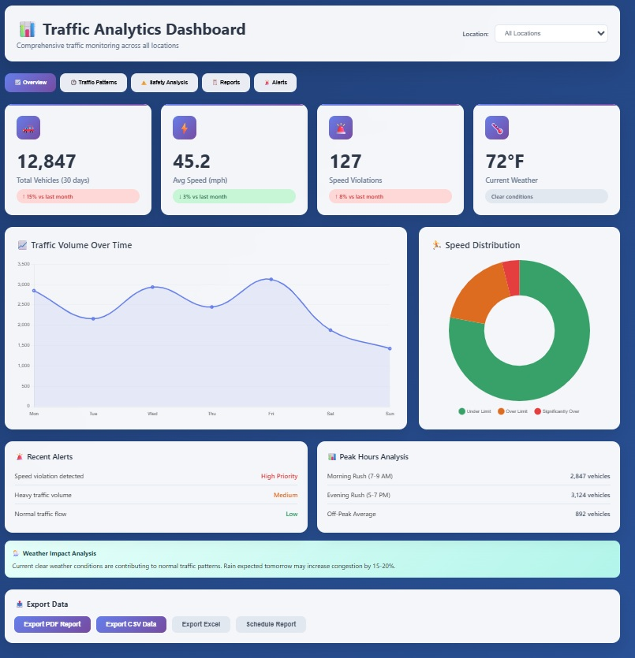
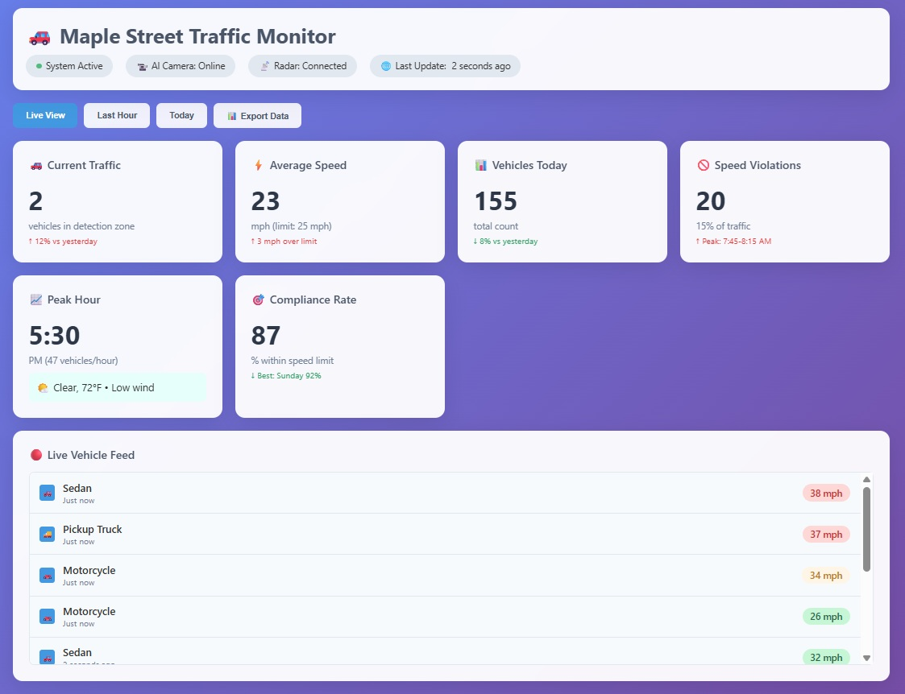

# References & Appendices

**Document Version:** 1.0  
**Last Updated:** August 7, 2025  
**Project:** Raspberry Pi 5 Edge ML Traffic Monitoring System  
**Authors:** Research Team  

## Table of Contents
1. References
2. Additional Visuals
3. Glossary
4. Code Review Summary
1. [References](#1-references)
2. [Additional Visuals](#2-additional-visuals)
3. [Glossary](#3-glossary)

**See also:**
- [Technical Design Document](./Technical_Design.md)
- [Implementation & Deployment Guide](./Implementation_Deployment.md)
- [User Guide](./User_Guide.md)
- [Project Management Summary](./Project_Management.md)

## 1. References

- **OmniPreSense OPS243-C Radar Sensor Datasheet:** [OPS-DS-003-M_OPS243.pdf](../archive/OPS-DS-003-M_OPS243.pdf)
- **Raspberry Pi 5 Documentation:** [Official Raspberry Pi Docs](https://www.raspberrypi.com/documentation/computers/)
- **Sony IMX500 AI Camera Documentation:** [Sony IMX500 Product Page](https://www.sony-semicon.com/en/products/IS/sensor/IMX500.html)
- **TensorFlow Documentation:** [https://www.tensorflow.org/](https://www.tensorflow.org/)
- **OpenCV Documentation:** [https://docs.opencv.org/](https://docs.opencv.org/)
- **Flask Documentation:** [https://flask.palletsprojects.com/](https://flask.palletsprojects.com/)
- **Flask-SocketIO Documentation:** [https://flask-socketio.readthedocs.io/](https://flask-socketio.readthedocs.io/)
- **PostgreSQL Documentation:** [https://www.postgresql.org/docs/](https://www.postgresql.org/docs/)
- **Relevant Academic Papers:**
  - Edge ML for Smart Cities: [example link]
  - Traffic Monitoring with Sensor Fusion: [example link]
- **Project Standards:**
  - IEEE 802.3af (PoE)
  - GDPR/CCPA (data privacy compliance)

## 2. Additional Visuals


### Visual References


*Figure 1: System Architecture Diagram*


*Figure 2: Data Flow from Sensors to Analytics and Dashboards*


*Figure 3: Cloud Dashboard - Main Analytics View*


*Figure 4: Cloud Dashboard - Event Table*


*Figure 5: Cloud Dashboard - System Status*


*Figure 6: Cloud Dashboard - Settings Panel*


*Figure 7: Cloud Dashboard - Historical Trends*


*Figure 8: Local Edge UI - Live View*


*Figure 9: Local Edge UI - Analytics Panel*


*Figure 10: Inside View of Residential Radar Enclosure*


*Figure 11: Installed Enclosure on Site*


*Figure 12: Radar Sensor Board Pinout*


*Figure 13: Radar Sensor Pinout Reference*


*Figure 14: External View of Enclosure*


*Figure 15: Standard Data Flow Overview*

## 3. Glossary

**Edge ML:** Machine learning performed on local devices rather than in the cloud.
**OPS243-C:** A Doppler radar sensor used for speed measurement.
**YOLOv8:** A real-time object detection algorithm.
**REST API:** An interface for communication between systems using HTTP requests.
**SocketIO:** A library for real-time web communication.
**SSD:** Solid State Drive, used for fast data storage.
**PoE:** Power over Ethernet, a method for delivering power and data over a single cable.
**HDF5:** A file format for storing large scientific data.
**CSV:** Comma-Separated Values, a simple file format for tabular data.
**JSON:** JavaScript Object Notation, a lightweight data-interchange format.
# 4. Code Review Summary
The source code for this project was reviewed by a peer developer to identify bugs and improve code quality. All feedback was addressed and changes were made as appropriate. (If code is added, update this section with reviewer details and feedback summary.)

| Term | Definition |
|------|------------|
| Edge ML | Machine learning performed locally on the device (not in the cloud) |
| REST API | Web service using HTTP methods for communication |
| WebSocket | Protocol for real-time, two-way communication |
| Data Fusion | Combining data from multiple sensors for improved accuracy |
| SORT | Simple Online and Realtime Tracking algorithm |
| PoE | Power over Ethernet |
| SSD | Solid State Drive |
| PWA | Progressive Web App |
| ERD | Entity Relationship Diagram |
| ML | Machine Learning |
| AI | Artificial Intelligence |
| GDPR | General Data Protection Regulation |
| CCPA | California Consumer Privacy Act |
| API | Application Programming Interface |
| UART | Universal Asynchronous Receiver-Transmitter |
| NTP | Network Time Protocol |

## 5. Appendix: Raspberry Pi SD Card File Structure

The following is a snapshot of the Raspberry Pi SD card (boot partition) file structure as captured from the D: drive on a Windows 11 machine. This provides insight into the overlays, device tree blobs, boot files, and configuration present on the SD card used for the project.


```
D: Drive File Structure
==================================================

D:\/
├── overlays/
│   ├── act-led.dtbo (589 bytes)
│   ├── adafruit18.dtbo (1.59 KB)
│   ├── adafruit-st7735r.dtbo (2.23 KB)
│   ├── adau1977-adc.dtbo (1.02 KB)
│   ├── adau7002-simple.dtbo (1.56 KB)
│   ├── ads1015.dtbo (2.46 KB)
│   ├── ads1115.dtbo (3.94 KB)
│   ├── ads7846.dtbo (2.48 KB)
│   ├── adv7282m.dtbo (1.76 KB)
│   ├── adv728x-m.dtbo (2.24 KB)
│   ├── akkordion-iqdacplus.dtbo (1.37 KB)
│   ├── allo-boss2-dac-audio.dtbo (1.80 KB)
│   ├── allo-boss-dac-pcm512x-audio.dtbo (1.62 KB)
│   ├── allo-digione.dtbo (1.19 KB)
│   ├── allo-katana-dac-audio.dtbo (1.66 KB)
│   ├── allo-piano-dac-pcm512x-audio.dtbo (1024 bytes)
│   ├── allo-piano-dac-plus-pcm512x-audio.dtbo (1.61 KB)
│   ├── anyspi.dtbo (3.80 KB)
│   ├── apds9960.dtbo (1.29 KB)
│   ├── applepi-dac.dtbo (1.43 KB)
│   ├── arducam-64mp.dtbo (3.48 KB)
│   ├── arducam-pivariety.dtbo (3.02 KB)
│   ├── at86rf233.dtbo (1.59 KB)
│   ├── audioinjector-addons.dtbo (1.83 KB)
│   ├── audioinjector-bare-i2s.dtbo (1.48 KB)
│   ├── audioinjector-isolated-soundcard.dtbo (1.58 KB)
│   ├── audioinjector-ultra.dtbo (1.86 KB)
│   ├── audioinjector-wm8731-audio.dtbo (800 bytes)
│   ├── audiosense-pi.dtbo (2.15 KB)
│   ├── audremap.dtbo (1.13 KB)
│   ├── audremap-pi5.dtbo (1.79 KB)
│   ├── balena-fin.dtbo (2.87 KB)
│   ├── bcm2712d0.dtbo (1.33 KB)
│   ├── camera-mux-2port.dtbo (28.08 KB)
│   ├── camera-mux-4port.dtbo (52.87 KB)
│   ├── cap1106.dtbo (1.28 KB)
│   ├── chipcap2.dtbo (1.83 KB)
│   ├── chipdip-dac.dtbo (1.22 KB)
│   ├── cirrus-wm5102.dtbo (4.00 KB)
│   ├── cma.dtbo (964 bytes)
│   ├── cm-swap-i2c0.dtbo (1.15 KB)
│   ├── crystalfontz-cfa050_pi_m.dtbo (3.54 KB)
│   ├── cutiepi-panel.dtbo (3.40 KB)
│   ├── dacberry400.dtbo (1.89 KB)
│   ├── dht11.dtbo (1.25 KB)
│   ├── dionaudio-kiwi.dtbo (672 bytes)
│   ├── dionaudio-loco.dtbo (676 bytes)
│   ├── dionaudio-loco-v2.dtbo (1.02 KB)
│   ├── disable-bt.dtbo (1.05 KB)
│   ├── disable-bt-pi5.dtbo (271 bytes)
│   ├── disable-emmc2.dtbo (267 bytes)
│   ├── disable-wifi.dtbo (387 bytes)
│   ├── disable-wifi-pi5.dtbo (267 bytes)
│   ├── dpi18.dtbo (951 bytes)
│   ├── dpi18cpadhi.dtbo (532 bytes)
│   ├── dpi24.dtbo (975 bytes)
│   ├── draws.dtbo (5.95 KB)
│   ├── dwc2.dtbo (801 bytes)
│   ├── dwc-otg.dtbo (293 bytes)
│   ├── dwc-otg-deprecated.dtbo (293 bytes)
│   ├── edt-ft5406.dtbo (2.59 KB)
│   ├── enc28j60.dtbo (1.37 KB)
│   ├── enc28j60-spi2.dtbo (1.25 KB)
│   ├── exc3000.dtbo (1.53 KB)
│   ├── ezsound-6x8iso.dtbo (3.68 KB)
│   ├── fbtft.dtbo (12.46 KB)
│   ├── fe-pi-audio.dtbo (1.87 KB)
│   ├── fsm-demo.dtbo (1.91 KB)
│   ├── gc9a01.dtbo (2.50 KB)
│   ├── ghost-amp.dtbo (3.20 KB)
│   ├── goodix.dtbo (1.57 KB)
│   ├── googlevoicehat-soundcard.dtbo (1.24 KB)
│   ├── gpio-charger.dtbo (1.16 KB)
│   ├── gpio-fan.dtbo (1.42 KB)
│   ├── gpio-hog.dtbo (621 bytes)
│   ├── gpio-ir.dtbo (1.23 KB)
│   ├── gpio-ir-tx.dtbo (1.07 KB)
│   ├── gpio-key.dtbo (1.34 KB)
│   ├── gpio-led.dtbo (1.27 KB)
│   ├── gpio-no-bank0-irq.dtbo (274 bytes)
│   ├── gpio-no-irq.dtbo (258 bytes)
│   ├── gpio-poweroff.dtbo (1.16 KB)
│   ├── gpio-shutdown.dtbo (1.43 KB)
│   ├── hat_map.dtb (2.24 KB)
│   ├── hd44780-i2c-lcd.dtbo (1.91 KB)
│   ├── hd44780-lcd.dtbo (1.62 KB)
│   ├── hdmi-backlight-hwhack-gpio.dtbo (1.14 KB)
│   ├── hifiberry-adc.dtbo (1.15 KB)
│   ├── hifiberry-adc8x.dtbo (1.16 KB)
│   ├── hifiberry-amp.dtbo (792 bytes)
│   ├── hifiberry-amp100.dtbo (2.21 KB)
│   ├── hifiberry-amp3.dtbo (1.43 KB)
│   ├── hifiberry-amp4pro.dtbo (1.88 KB)
│   ├── hifiberry-dac.dtbo (668 bytes)
│   ├── hifiberry-dac8x.dtbo (1.25 KB)
│   ├── hifiberry-dacplus.dtbo (2.05 KB)
│   ├── hifiberry-dacplusadc.dtbo (1.94 KB)
│   ├── hifiberry-dacplusadcpro.dtbo (2.21 KB)
│   ├── hifiberry-dacplusdsp.dtbo (712 bytes)
│   ├── hifiberry-dacplushd.dtbo (1.62 KB)
│   ├── hifiberry-dacplus-pro.dtbo (1.86 KB)
│   ├── hifiberry-dacplus-std.dtbo (1.85 KB)
│   ├── hifiberry-digi.dtbo (972 bytes)
│   ├── hifiberry-digi-pro.dtbo (1.11 KB)
│   ├── highperi.dtbo (1.05 KB)
│   ├── hy28a.dtbo (2.39 KB)
│   ├── hy28b.dtbo (2.85 KB)
│   ├── hy28b-2017.dtbo (2.83 KB)
│   ├── i2c0.dtbo (1.74 KB)
│   ├── i2c0-pi5.dtbo (931 bytes)
│   ├── i2c1.dtbo (1004 bytes)
│   ├── i2c1-pi5.dtbo (935 bytes)
│   ├── i2c2-pi5.dtbo (815 bytes)
│   ├── i2c3.dtbo (811 bytes)
│   ├── i2c3-pi5.dtbo (937 bytes)
│   ├── i2c4.dtbo (811 bytes)
│   ├── i2c5.dtbo (815 bytes)
│   ├── i2c6.dtbo (813 bytes)
│   ├── i2c-bcm2708.dtbo (270 bytes)
│   ├── i2c-fan.dtbo (3.58 KB)
│   ├── i2c-gpio.dtbo (1.03 KB)
│   ├── i2c-mux.dtbo (3.79 KB)
│   ├── i2c-pwm-pca9685a.dtbo (2.10 KB)
│   ├── i2c-rtc.dtbo (9.07 KB)
│   ├── i2c-rtc-gpio.dtbo (8.16 KB)
│   ├── i2c-sensor.dtbo (19.41 KB)
│   ├── i2s-dac.dtbo (656 bytes)
│   ├── i2s-gpio28-31.dtbo (307 bytes)
│   ├── i2s-master-dac.dtbo (1.39 KB)
│   ├── ilitek251x.dtbo (1.46 KB)
│   ├── imx219.dtbo (3.61 KB)
│   ├── imx258.dtbo (4.21 KB)
│   ├── imx283.dtbo (3.45 KB)
│   ├── imx290.dtbo (3.78 KB)
│   ├── imx296.dtbo (3.61 KB)
│   ├── imx327.dtbo (3.78 KB)
│   ├── imx335.dtbo (3.65 KB)
│   ├── imx378.dtbo (3.71 KB)
│   ├── imx415.dtbo (4.09 KB)
│   ├── imx462.dtbo (3.78 KB)
│   ├── imx477.dtbo (3.71 KB)
│   ├── imx500.dtbo (4.58 KB)
│   ├── imx500-pi5.dtbo (4.92 KB)
│   ├── imx519.dtbo (3.40 KB)
│   ├── imx708.dtbo (3.96 KB)
│   ├── interludeaudio-analog.dtbo (1.96 KB)
│   ├── interludeaudio-digital.dtbo (1.40 KB)
│   ├── iqaudio-codec.dtbo (908 bytes)
│   ├── iqaudio-dac.dtbo (1.25 KB)
│   ├── iqaudio-dacplus.dtbo (1.49 KB)
│   ├── iqaudio-digi-wm8804-audio.dtbo (1.31 KB)
│   ├── iqs550.dtbo (1.77 KB)
│   ├── irs1125.dtbo (2.73 KB)
│   ├── i-sabre-q2m.dtbo (906 bytes)
│   ├── jedec-spi-nor.dtbo (4.39 KB)
│   ├── justboom-both.dtbo (1.61 KB)
│   ├── justboom-dac.dtbo (1.26 KB)
│   ├── justboom-digi.dtbo (968 bytes)
│   ├── ltc294x.dtbo (1.87 KB)
│   ├── max98357a.dtbo (1.90 KB)
│   ├── maxtherm.dtbo (4.26 KB)
│   ├── mbed-dac.dtbo (1.58 KB)
│   ├── mcp23017.dtbo (3.11 KB)
│   ├── mcp23s17.dtbo (14.85 KB)
│   ├── mcp2515.dtbo (3.75 KB)
│   ├── mcp2515-can0.dtbo (1.75 KB)
│   ├── mcp2515-can1.dtbo (1.75 KB)
│   ├── mcp251xfd.dtbo (6.28 KB)
│   ├── mcp3008.dtbo (4.21 KB)
│   ├── mcp3202.dtbo (4.11 KB)
│   ├── mcp342x.dtbo (2.79 KB)
│   ├── media-center.dtbo (2.44 KB)
│   ├── merus-amp.dtbo (1.68 KB)
│   ├── midi-uart0.dtbo (716 bytes)
│   ├── midi-uart0-pi5.dtbo (808 bytes)
│   ├── midi-uart1.dtbo (857 bytes)
│   ├── midi-uart1-pi5.dtbo (808 bytes)
│   ├── midi-uart2.dtbo (716 bytes)
│   ├── midi-uart2-pi5.dtbo (808 bytes)
│   ├── midi-uart3.dtbo (716 bytes)
│   ├── midi-uart3-pi5.dtbo (808 bytes)
│   ├── midi-uart4.dtbo (716 bytes)
│   ├── midi-uart4-pi5.dtbo (808 bytes)
│   ├── midi-uart5.dtbo (716 bytes)
│   ├── minipitft13.dtbo (1.74 KB)
│   ├── miniuart-bt.dtbo (1.53 KB)
│   ├── mipi-dbi-spi.dtbo (5.04 KB)
│   ├── mira220.dtbo (2.93 KB)
│   ├── mlx90640.dtbo (549 bytes)
│   ├── mmc.dtbo (1.19 KB)
│   ├── mz61581.dtbo (2.76 KB)
│   ├── ov2311.dtbo (2.86 KB)
│   ├── ov5647.dtbo (3.42 KB)
│   ├── ov64a40.dtbo (3.45 KB)
│   ├── ov7251.dtbo (2.90 KB)
│   ├── ov9281.dtbo (3.38 KB)
│   ├── overlay_map.dtb (5.81 KB)
│   ├── papirus.dtbo (2.28 KB)
│   ├── pca953x.dtbo (4.02 KB)
│   ├── pcf857x.dtbo (2.45 KB)
│   ├── pcie-32bit-dma.dtbo (438 bytes)
│   ├── pcie-32bit-dma-pi5.dtbo (346 bytes)
│   ├── pciex1-compat-pi5.dtbo (851 bytes)
│   ├── pibell.dtbo (2.29 KB)
│   ├── pifacedigital.dtbo (1.67 KB)
│   ├── pifi-40.dtbo (1.36 KB)
│   ├── pifi-dac-hd.dtbo (1.18 KB)
│   ├── pifi-dac-zero.dtbo (1.15 KB)
│   ├── pifi-mini-210.dtbo (971 bytes)
│   ├── piglow.dtbo (1.56 KB)
│   ├── pimidi.dtbo (1.11 KB)
│   ├── pineboards-hat-ai.dtbo (299 bytes)
│   ├── pineboards-hatdrive-poe-plus.dtbo (328 bytes)
│   ├── piscreen.dtbo (2.93 KB)
│   ├── piscreen2r.dtbo (2.53 KB)
│   ├── pisound.dtbo (2.31 KB)
│   ├── pisound-micro.dtbo (2.90 KB)
│   ├── pisound-pi5.dtbo (2.31 KB)
│   ├── pitft22.dtbo (1.65 KB)
│   ├── pitft28-capacitive.dtbo (2.40 KB)
│   ├── pitft28-resistive.dtbo (3.04 KB)
│   ├── pitft35-resistive.dtbo (3.14 KB)
│   ├── pivision.dtbo (4.22 KB)
│   ├── pps-gpio.dtbo (1.16 KB)
│   ├── proto-codec.dtbo (784 bytes)
│   ├── pwm.dtbo (948 bytes)
│   ├── pwm1.dtbo (1.46 KB)
│   ├── pwm-2chan.dtbo (1.03 KB)
│   ├── pwm-gpio.dtbo (1006 bytes)
│   ├── pwm-gpio-fan.dtbo (3.47 KB)
│   ├── pwm-ir-tx.dtbo (1.01 KB)
│   ├── pwm-pio.dtbo (1010 bytes)
│   ├── qca7000.dtbo (1.36 KB)
│   ├── qca7000-uart0.dtbo (1.10 KB)
│   ├── ramoops.dtbo (737 bytes)
│   ├── ramoops-pi4.dtbo (741 bytes)
│   ├── README (266.76 KB)
│   ├── rootmaster.dtbo (1.94 KB)
│   ├── rotary-encoder.dtbo (1.88 KB)
│   ├── rpi-backlight.dtbo (489 bytes)
│   ├── rpi-codeczero.dtbo (1.03 KB)
│   ├── rpi-dacplus.dtbo (1.38 KB)
│   ├── rpi-dacpro.dtbo (1.39 KB)
│   ├── rpi-digiampplus.dtbo (1.70 KB)
│   ├── rpi-ft5406.dtbo (842 bytes)
│   ├── rpi-fw-uart.dtbo (1.36 KB)
│   ├── rpi-poe.dtbo (4.23 KB)
│   ├── rpi-poe-plus.dtbo (4.80 KB)
│   ├── rpi-sense.dtbo (1.50 KB)
│   ├── rpi-sense-v2.dtbo (1.50 KB)
│   ├── rpi-tv.dtbo (567 bytes)
│   ├── rra-digidac1-wm8741-audio.dtbo (1.28 KB)
│   ├── sainsmart18.dtbo (1.39 KB)
│   ├── sc16is750-i2c.dtbo (3.14 KB)
│   ├── sc16is750-spi0.dtbo (1.72 KB)
│   ├── sc16is752-i2c.dtbo (3.14 KB)
│   ├── sc16is752-spi0.dtbo (1.72 KB)
│   ├── sc16is752-spi1.dtbo (2.11 KB)
│   ├── sc16is75x-spi.dtbo (4.08 KB)
│   ├── sdhost.dtbo (968 bytes)
│   ├── sdio.dtbo (1.84 KB)
│   ├── sdio-pi5.dtbo (660 bytes)
│   ├── seeed-can-fd-hat-v1.dtbo (3.31 KB)
│   ├── seeed-can-fd-hat-v2.dtbo (2.66 KB)
│   ├── sh1106-spi.dtbo (2.05 KB)
│   ├── si446x-spi0.dtbo (1.39 KB)
│   ├── smi.dtbo (981 bytes)
│   ├── smi-dev.dtbo (404 bytes)
│   ├── smi-nand.dtbo (1.44 KB)
│   ├── spi0-0cs.dtbo (794 bytes)
│   ├── spi0-1cs.dtbo (1.02 KB)
│   ├── spi0-1cs-inverted.dtbo (1.14 KB)
│   ├── spi0-2cs.dtbo (1.02 KB)
│   ├── spi1-1cs.dtbo (1.49 KB)
│   ├── spi1-2cs.dtbo (1.85 KB)
│   ├── spi1-3cs.dtbo (2.22 KB)
│   ├── spi2-1cs.dtbo (1.49 KB)
│   ├── spi2-1cs-pi5.dtbo (892 bytes)
│   ├── spi2-2cs.dtbo (1.85 KB)
│   ├── spi2-2cs-pi5.dtbo (1.21 KB)
│   ├── spi2-3cs.dtbo (2.22 KB)
│   ├── spi3-1cs.dtbo (1.10 KB)
│   ├── spi3-1cs-pi5.dtbo (892 bytes)
│   ├── spi3-2cs.dtbo (1.47 KB)
│   ├── spi3-2cs-pi5.dtbo (1.21 KB)
│   ├── spi4-1cs.dtbo (1.10 KB)
│   ├── spi4-2cs.dtbo (1.47 KB)
│   ├── spi5-1cs.dtbo (1.10 KB)
│   ├── spi5-1cs-pi5.dtbo (892 bytes)
│   ├── spi5-2cs.dtbo (1.47 KB)
│   ├── spi5-2cs-pi5.dtbo (1.21 KB)
│   ├── spi6-1cs.dtbo (1.10 KB)
│   ├── spi6-2cs.dtbo (1.47 KB)
│   ├── spi-gpio35-39.dtbo (630 bytes)
│   ├── spi-gpio40-45.dtbo (795 bytes)
│   ├── spi-rtc.dtbo (2.00 KB)
│   ├── ssd1306.dtbo (1.10 KB)
│   ├── ssd1306-spi.dtbo (2.11 KB)
│   ├── ssd1327-spi.dtbo (1.65 KB)
│   ├── ssd1331-spi.dtbo (2.00 KB)
│   ├── ssd1351-spi.dtbo (2.00 KB)
│   ├── sunfounder-pipower3.dtbo (1.13 KB)
│   ├── sunfounder-pironman5.dtbo (1.35 KB)
│   ├── superaudioboard.dtbo (1.93 KB)
│   ├── sx150x.dtbo (34.74 KB)
│   ├── tc358743.dtbo (2.94 KB)
│   ├── tc358743-audio.dtbo (1.51 KB)
│   ├── tc358743-pi5.dtbo (2.78 KB)
│   ├── tinylcd35.dtbo (4.71 KB)
│   ├── tpm-slb9670.dtbo (779 bytes)
│   ├── tpm-slb9673.dtbo (1.04 KB)
│   ├── uart0.dtbo (936 bytes)
│   ├── uart0-pi5.dtbo (627 bytes)
│   ├── uart1.dtbo (988 bytes)
│   ├── uart1-pi5.dtbo (627 bytes)
│   ├── uart2.dtbo (1016 bytes)
│   ├── uart2-pi5.dtbo (627 bytes)
│   ├── uart3.dtbo (1016 bytes)
│   ├── uart3-pi5.dtbo (627 bytes)
│   ├── uart4.dtbo (1016 bytes)
│   ├── uart4-pi5.dtbo (627 bytes)
│   ├── uart5.dtbo (1016 bytes)
│   ├── udrc.dtbo (3.46 KB)
│   ├── ugreen-dabboard.dtbo (1.50 KB)
│   ├── upstream.dtbo (2.03 KB)
│   ├── upstream-pi4.dtbo (2.71 KB)
│   ├── vc4-fkms-v3d.dtbo (1.52 KB)
│   ├── vc4-fkms-v3d-pi4.dtbo (1.52 KB)
│   ├── vc4-kms-dpi-generic.dtbo (5.86 KB)
│   ├── vc4-kms-dpi-hyperpixel2r.dtbo (3.20 KB)
│   ├── vc4-kms-dpi-hyperpixel4.dtbo (3.76 KB)
│   ├── vc4-kms-dpi-hyperpixel4sq.dtbo (3.29 KB)
│   ├── vc4-kms-dpi-panel.dtbo (4.13 KB)
│   ├── vc4-kms-dsi-7inch.dtbo (4.12 KB)
│   ├── vc4-kms-dsi-generic.dtbo (3.06 KB)
│   ├── vc4-kms-dsi-ili9881-5inch.dtbo (3.31 KB)
│   ├── vc4-kms-dsi-ili9881-7inch.dtbo (3.37 KB)
│   ├── vc4-kms-dsi-lt070me05000.dtbo (1.84 KB)
│   ├── vc4-kms-dsi-lt070me05000-v2.dtbo (1.50 KB)
│   ├── vc4-kms-dsi-waveshare-800x480.dtbo (4.01 KB)
│   ├── vc4-kms-dsi-waveshare-panel.dtbo (4.85 KB)
│   ├── vc4-kms-dsi-waveshare-panel-v2.dtbo (3.17 KB)
│   ├── vc4-kms-kippah-7inch.dtbo (3.43 KB)
│   ├── vc4-kms-v3d.dtbo (2.70 KB)
│   ├── vc4-kms-v3d-pi4.dtbo (3.82 KB)
│   ├── vc4-kms-v3d-pi5.dtbo (3.27 KB)
│   ├── vc4-kms-vga666.dtbo (2.27 KB)
│   ├── vga666.dtbo (758 bytes)
│   ├── vl805.dtbo (352 bytes)
│   ├── w1-gpio.dtbo (1.01 KB)
│   ├── w1-gpio-pi5.dtbo (1.14 KB)
│   ├── w1-gpio-pullup.dtbo (1.14 KB)
│   ├── w1-gpio-pullup-pi5.dtbo (1.27 KB)
│   ├── w5500.dtbo (1.52 KB)
│   ├── watterott-display.dtbo (3.99 KB)
│   ├── waveshare-can-fd-hat-mode-a.dtbo (3.31 KB)
│   ├── waveshare-can-fd-hat-mode-b.dtbo (2.45 KB)
│   ├── wifimac.dtbo (529 bytes)
│   ├── wittypi.dtbo (1.03 KB)
│   ├── wm8960-soundcard.dtbo (2.31 KB)
│   └── ws2812-pio.dtbo (1.33 KB)
├── bcm2710-rpi-2-b.dtb (31.73 KB)
├── bcm2710-rpi-3-b.dtb (33.87 KB)
├── bcm2710-rpi-3-b-plus.dtb (34.49 KB)
├── bcm2710-rpi-cm0.dtb (32.89 KB)
├── bcm2710-rpi-cm3.dtb (31.50 KB)
├── bcm2710-rpi-zero-2.dtb (32.88 KB)
├── bcm2710-rpi-zero-2-w.dtb (32.88 KB)
├── bcm2711-rpi-400.dtb (54.92 KB)
├── bcm2711-rpi-4-b.dtb (54.92 KB)
├── bcm2711-rpi-cm4.dtb (55.43 KB)
├── bcm2711-rpi-cm4-io.dtb (38.98 KB)
├── bcm2711-rpi-cm4s.dtb (52.25 KB)
├── bcm2712d0-rpi-5-b.dtb (76.60 KB)
├── bcm2712-d-rpi-5-b.dtb (76.59 KB)
├── bcm2712-rpi-500.dtb (76.55 KB)
├── bcm2712-rpi-5-b.dtb (76.60 KB)
├── bcm2712-rpi-cm5-cm4io.dtb (77.29 KB)
├── bcm2712-rpi-cm5-cm5io.dtb (77.36 KB)
├── bcm2712-rpi-cm5l-cm4io.dtb (77.33 KB)
├── bcm2712-rpi-cm5l-cm5io.dtb (77.40 KB)
├── bootcode.bin (51.25 KB)
├── cmdline.txt (154 bytes)
├── config.txt (1.26 KB)
├── fixup.dat (7.15 KB)
├── fixup_cd.dat (3.15 KB)
├── fixup_db.dat (10.05 KB)
├── fixup_x.dat (10.05 KB)
├── fixup4.dat (5.33 KB)
├── fixup4cd.dat (3.15 KB)
├── fixup4db.dat (8.25 KB)
├── fixup4x.dat (8.25 KB)
├── initramfs_2712 (12.71 MB)
├── initramfs8 (12.71 MB)
├── issue.txt (145 bytes)
├── kernel_2712.img (9.50 MB)
├── kernel8.img (9.50 MB)
├── LICENCE.broadcom (1.56 KB)
├── network-config (170 bytes)
├── start.elf (2.85 MB)
├── start_cd.elf (795.06 KB)
├── start_db.elf (4.61 MB)
├── start_x.elf (3.56 MB)
├── start4.elf (2.16 MB)
├── start4cd.elf (795.06 KB)
├── start4db.elf (3.59 MB)
├── start4x.elf (2.87 MB)
└── userconf.txt (111 bytes)
```

## 4. Future Work & Clarifications

### Future Work
- **Reference Expansion:** Add more academic papers, standards, and regulatory references as the system evolves.
- **Visual Documentation:** Continue to update and expand the visual appendix as new diagrams and photos are produced.
- **Glossary Growth:** Expand glossary to include new terms as features and technologies are added.

### Contradictions & Clarifications
- The GitHub repository may reference additional standards, visuals, or documentation not yet included here. These will be added in future updates.
- Some referenced documents or visuals may be in draft or planned status; clarify in future revisions.

### Repository Reference
- For the latest references, visuals, and glossary updates, see: [CST_590_Computer_Science_Capstone_Project GitHub](https://github.com/gcu-merk/CST_590_Computer_Science_Capstone_Project)
