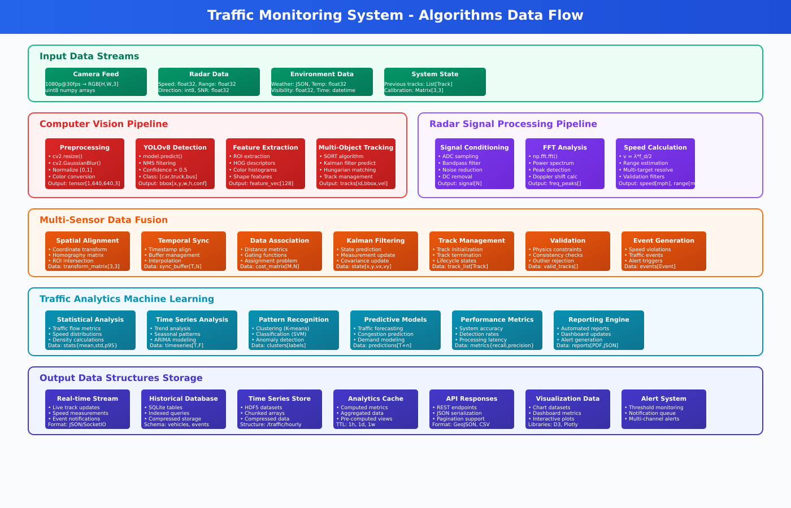

# Technical Design Document

**Document Version:** 1.0  
**Last Updated:** August 7, 2025  
**Project:** Raspberry Pi 5 Edge ML Traffic Monitoring System  
**Authors:** Technical Team  

## Table of Contents

1. [System Overview](#1-system-overview)
2. [System Architecture](#2-system-architecture)
3. [Hardware Design](#3-hardware-design)
4. [Architectural Design Comparison](#architectural-design-comparison)

**See also:**

- [Implementation & Deployment Guide](./Implementation_Deployment.md)
- [User Guide](./User_Guide.md)
- [Project Management Summary](./Project_Management.md)
- [References & Appendices](./References_Appendices.md)

## 1. System Overview

The Raspberry Pi 5 Edge ML Traffic Monitoring System is designed to provide real-time vehicle detection, speed measurement, and traffic analytics at the edge. The system leverages a Raspberry Pi 5, an AI-enabled camera, and an OmniPreSense OPS243-C radar sensor to process video and radar data locally, sending only processed results to cloud services for aggregation and reporting. This approach reduces bandwidth, increases privacy, and enables rapid response to traffic events.

**Objectives:**

- Deploy a low-cost, scalable, and reliable edge-based traffic monitoring solution
- Integrate ML/AI for vehicle detection, classification, and anomaly detection
- Fuse camera and radar data for accurate speed and event measurement
- Provide real-time dashboards and cloud-based analytics

**Key Features:**

- Local ML inference and data fusion
- Real-time web dashboard (Edge UI)
- Cloud integration for historical analytics and alerts (Cloud UI)
- Modular, container-friendly architecture

## 2. System Architecture

### Unified Architecture Diagram

```text
+-------------------------------------------------------------+
|                Cloud Services Layer (Optional)              |
|  +-------------------+   +-------------------+              |
|  | Data Aggregation  |   | Analytics Engine  |              |
|  |   (AWS Lambda,    |   |  (Time Series DB) |              |
|  |   DynamoDB, etc.) |   +-------------------+              |
|  +-------------------+   | Cloud UI, Alerts  |              |
|         |                    |                              |
+---------|--------------------|------------------------------+
          |                    |
          v                    v
+-------------------------------------------------------------+
|         Network & Communication Layer                       |
|  +-------------------+   +-------------------+              |
|  | WebSocket Server  |   | REST API Endpoints|              |
|  +-------------------+   +-------------------+              |
|  | Data Compression  |   | Network Resilience|              |
+---------|--------------------|------------------------------+
          |                    |
          v                    v
+-------------------------------------------------------------+
|         Edge Processing Layer (Raspberry Pi 5)              |
|  +-------------------+   +-------------------+              |
|  | Vehicle Detection |   | Speed Analysis    |              |
|  |  (TensorFlow,     |   |  (OPS243-C Radar) |              |
|  |   OpenCV, AI Cam) |   +-------------------+              |
|  +-------------------+   | Multi-Vehicle     |              |
|  | Data Fusion Engine|   | Tracking (SORT)   |              |
|  +-------------------+   +-------------------+              |
|  | Edge API Gateway  |   | Edge UI (Web Dash)|              |
|  +-------------------+   +-------------------+              |
|  | System Health/    |   | Local Storage     |              |
|  | Watchdog/Weather  |   | Manager           |              |
+---------|--------------------|------------------------------+
          |                    |
          v                    v
+-------------------------------------------------------------+
|         Physical Sensing Layer                              |
|  +-------------------+   +-------------------+              |
|  | AI Camera         |   | OPS243-C Radar    |              |
|  | (Sony IMX500)     |   | (Doppler, UART)   |              |
|  +-------------------+   +-------------------+              |
|  | Raspberry Pi 5    |   | External SSD      |              |
|  | (16GB RAM, ARM)   |   | (Samsung T7)      |              |
|  +-------------------+   +-------------------+              |
|  | Power & Connectivity (PoE, WiFi/Ethernet, Cellular)      |
|  | Environmental Housing (IP65/IP66)                        |
+-------------------------------------------------------------+
```

## 2.1 Physical Architecture Overview

```text
+-------------------------------------------------------------+
|           Cloud / Data Center (Optional, Remote)            |
|  - Cloud UI (Web Dashboard)                                 |
|  - Data Aggregation, Analytics Engine, Alert Service        |
|  - Long-term Storage, Model Management                      |
+---------------------^---------------------------------------+
                      |
                      v
+-------------------------------------------------------------+
|           Local Network / Internet                          |
|  - WiFi / Ethernet / Cellular                               |
+---------------------^---------------------------------------+
                      |
                      v
+-------------------------------------------------------------+
|           Edge Device: Raspberry Pi 5 Enclosure             |
|                                                             |
|  +-------------------+   +-------------------+              |
|  | Raspberry Pi 5    |   | Power Supply      |              |
|  | (16GB RAM, ARM)   |   | (PoE, USB-C, UPS) |              |
|  +-------------------+   +-------------------+              |
|  | External SSD      |   | Environmental     |              |
|  | (Samsung T7)      |   | Housing (IP65)    |              |
|  +-------------------+   +-------------------+              |
|                                                             |
|  +-------------------+   +-------------------+              |
|  | AI Camera         |   | OPS243-C Radar    |              |
|  | (Sony IMX500)     |   | (UART, Doppler)   |              |
|  +-------------------+   +-------------------+              |
|                                                             |
|  [All sensors and storage connect to the Pi 5]              |
|                                                             |
|  - Edge UI (Web Dashboard runs on Pi 5)                     |
|  - Vehicle Detection (TensorFlow/OpenCV on Pi 5)            |
|  - Speed Analysis (Radar on Pi 5)                           |
|  - Data Fusion, Local Storage, Health Monitoring (on Pi 5)  |
+-------------------------------------------------------------+
```

## 3. Hardware Design

This section describes the hardware components and their specifications for the Raspberry Pi 5 Edge ML Traffic Monitoring System.

- **Raspberry Pi 5 (16GB RAM, ARM Cortex-A76 CPU)**
- **AI Camera (Sony IMX500 sensor)**
- **OPS243-C FMCW Doppler Radar Sensor**
- **External USB SSD (Samsung T7 or similar)**
- **Power & Connectivity:** PoE, WiFi/Ethernet, optional cellular backup


### Figure 1: System Architecture Diagram



### Figure 2: Data Flow from Sensors to Analytics and Dashboards

### Architecture Layers

#### Layer 1: Physical Sensing Layer

- Raspberry Pi AI Camera (Sony IMX500 sensor)

- OPS243-C FMCW Doppler Radar Sensor

- Raspberry Pi 5 (16GB RAM, ARM Cortex-A76 CPU)

- External USB SSD (Samsung T7 or similar)

- Power & Connectivity (PoE, WiFi/Ethernet, optional cellular backup)

#### Layer 2: Edge Processing Layer (Raspberry Pi 5)

- Vehicle Detection Service (TensorFlow + OpenCV + AI Camera)

- Speed Analysis Service (OPS243-C radar data processing)

- Multi-Vehicle Tracking (SORT algorithm)

- Data Fusion Engine (Camera + Radar correlation)

- Edge API Gateway (Flask/Flask-SocketIO server)

- Edge UI (Local Web Dashboard)

- System Health Monitor, Local Storage Manager

#### Layer 3: Network & Communication Layer

- Local Network Interface (WiFi/Ethernet)

- WebSocket Server (real-time streaming)

- REST API Endpoints (configuration/status)

- Data Compression & Queuing

- Network Resilience (offline-first, reconnection logic)

#### Layer 4: Cloud Services Layer (Optional)

- Data Aggregation Service (AWS Lambda, DynamoDB, or similar)

- Time Series Database, Analytics Engine

- Cloud UI (Web Dashboard), Alert Service, API Gateway

### Technologies and Protocols Used

- Python 3, TensorFlow, OpenCV, Flask, Flask-SocketIO

- UART/Serial for radar communication

- WebSocket/REST for dashboard and API

- MQTT (optional, for cloud data transmission)

- Docker (recommended for deployment)
