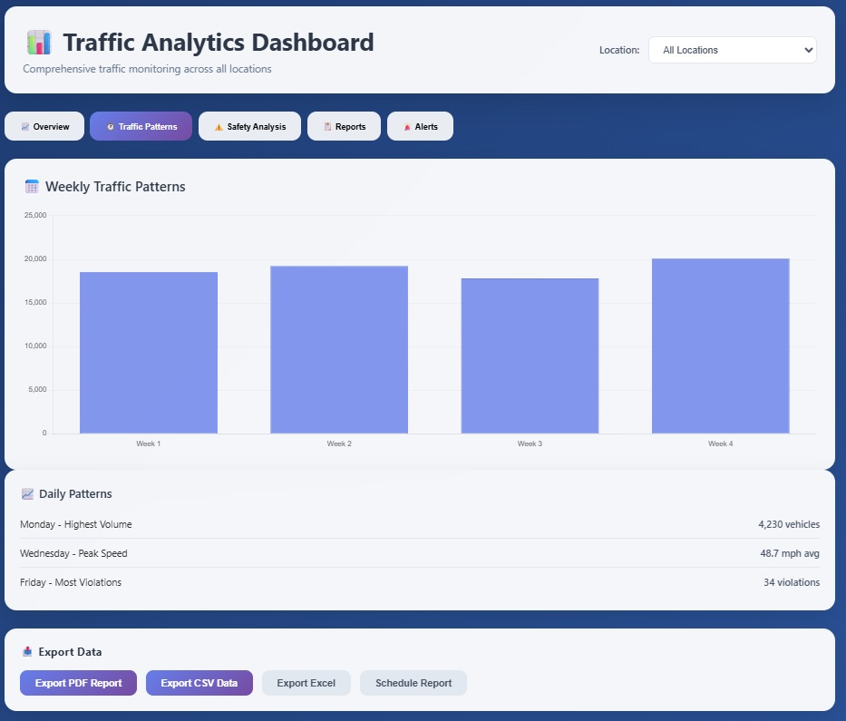
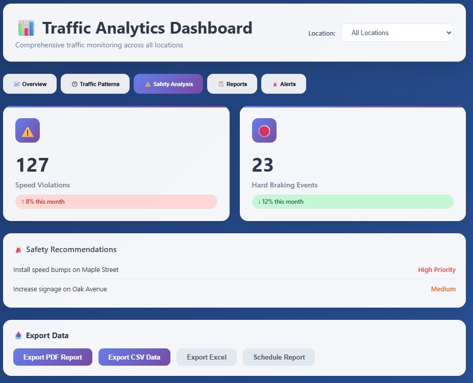
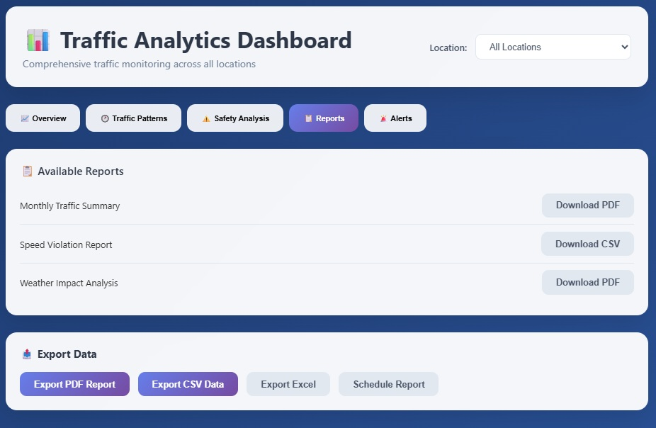
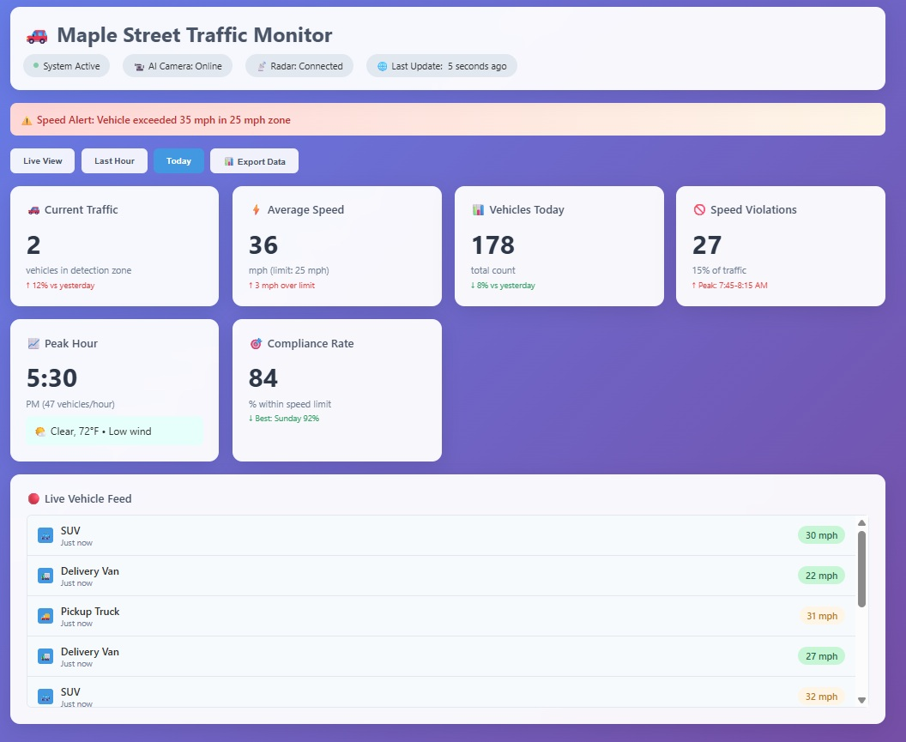

# User Guide

---

## Raspberry Pi 5 Edge ML Traffic Monitoring System - User Guide

**Version:** 1.2  
**Date:** December 11, 2025  
**Copyright:** © 2025 gcu-merk. All rights reserved.  
**Preface:**  
This guide provides comprehensive instructions for installing, configuring, and using the Raspberry Pi 5 Edge ML Traffic Monitoring System. It is intended for both technical and non-technical users.

---

**Document Version:** 1.0  
**Last Updated:** December 11, 2025  
**Project:** Raspberry Pi 5 Edge ML Traffic Monitoring System  
**Authors:** Documentation Team  

## Table of Contents

1. [System Features Overview](#1-system-features-overview)
2. [Hardware Setup Quick Reference](#2-hardware-setup-quick-reference)
3. [Web Dashboard](#3-web-dashboard)
4. [Mobile App (if applicable)](#4-mobile-app-if-applicable)
5. [Example Use Cases](#5-example-use-cases)
6. [Frequently Asked Questions](#6-frequently-asked-questions)
7. [Support](#7-support)
8. [Glossary](#8-glossary)  
9. [Appendices](#9-appendices)

**See also:**

- [Technical Design Document](./Technical_Design.md)
- [Implementation & Deployment Guide](./Implementation_Deployment.md)
- [Project Management Summary](./Project_Management.md)
- [References & Appendices](./References_Appendices.md)

## 1. System Features Overview

### Accessibility & Safety Information

- The dashboard and documentation use high-contrast colors and large fonts for readability.
- All visuals and diagrams include descriptive alt text.
- The system is designed for safe installation and operation. Follow all electrical and mounting instructions to avoid injury.

The Raspberry Pi 5 Edge ML Traffic Monitoring System provides real-time vehicle detection, classification, speed measurement, and traffic analytics at the edge. The system leverages radar-triggered edge AI processing using the Sony IMX500 camera's built-in neural processing unit for on-camera vehicle classification. This advanced approach provides intelligent, power-efficient traffic monitoring with minimal latency and enhanced accuracy.

**Key Features:**

- **Radar-Triggered Edge AI:** Combines OPS243-C radar detection with IMX500 on-camera AI processing
- **Real-time Vehicle Classification:** 85-95% accuracy for vehicle type identification  
- **Ultra-Low Latency:** <350ms from detection to classification
- **Power Efficient:** 4-6W average power consumption
- **Multi-Sensor Fusion:** Correlates radar speed/direction with AI vehicle identification
- **Privacy-First:** All AI processing happens locally on the camera sensor
- **Weather Independent:** Radar detection works in all weather conditions

**For technical details on the ML/AI workflow and component status, see the [ML/AI Workflow and Component Status](./Technical_Design.md#31-mlai-workflow-and-component-status) section in the Technical Design Document.**

### Main Features

- Real-time vehicle detection and classification using AI camera
- Speed measurement using radar sensor
- Data fusion for accurate event logging
- Local web dashboard (Edge UI) for live monitoring and configuration
- Cloud dashboard (Cloud UI) for historical analytics and alerts
- REST and WebSocket APIs for integration and automation

### User Roles

- **Operator:** Installs, configures, and maintains the system on-site
- **Traffic Analyst:** Reviews real-time and historical data, generates reports
- **Administrator:** Manages user access, system configuration, and cloud integration

## 2. Hardware Setup Quick Reference

This section provides a quick reference for the hardware connections. For detailed installation instructions, see the [Implementation & Deployment Guide](./Implementation_Deployment.md).

### OPS243-C Radar Sensor Pinout

| OPS243 Pin | Function | Wire Color | RPi Physical Pin | RPi GPIO | Notes |
|------------|----------|------------|------------------|----------|-------|
| Pin 3 | Host Interrupt | Orange | Pin 16 | GPIO23 | Real-time detection |
| Pin 4 | Reset | Yellow | Pin 18 | GPIO24 | Software reset |
| Pin 6 | UART RxD | Green | Pin 8 | GPIO14 (TXD) | Commands to radar |
| Pin 7 | UART TxD | White | Pin 10 | GPIO15 (RXD) | Data from radar |
| Pin 9 | 5V Power | Red | Pin 4 | 5V Power | 150mA typical |
| Pin 10 | Ground | Black | Pin 6 | Ground | Common ground |
| **Pin 1** | **Low Alert** | **Blue** | **Pin 29** | **GPIO5** | **Speed/range alerts** |
| **Pin 2** | **High Alert** | **Purple** | **Pin 31** | **GPIO6** | **Speed/range alerts** |

### Key Hardware Features

- **IMX500 AI Camera**: 12MP sensor with on-chip AI processing (CSI-2 ribbon cable)
- **OPS243-C Radar**: 24.125 GHz FMCW radar with 200m range (GPIO + UART)
- **External SSD**: Samsung T7 Shield 2TB for local storage (USB 3.2)
- **Power**: 5.1V 5A official PSU or PoE+ HAT

### Connection Verification

```bash
# Test camera
libcamera-hello --preview=none --timeout=5000

# Test radar UART
sudo cat /dev/ttyACM0

# Check GPIO status
gpio readall
```

For complete installation instructions, hardware assembly, and troubleshooting, see:
- [Technical Design Document - Hardware Design](./Technical_Design.md#3-hardware-design)
- [Implementation & Deployment Guide - Hardware Assembly](./Implementation_Deployment.md#22-hardware-assembly)

## 3. Web Dashboard

The Edge UI (local web dashboard) provides real-time monitoring, configuration, and analytics for the traffic monitoring system. The Cloud UI (optional) extends these features with historical data and remote management.

### Layout & Navigation

- **Header:** Displays system name, current status, and navigation links (e.g., Live View, Analytics, Settings)
- **Live View Panel:**
  - Real-time video feed from the AI camera (if enabled)
  - Overlay of detected vehicles and bounding boxes
  - Speed readings from radar sensor
- **Event Table:**
  - List of recent vehicle events (timestamp, type, speed, location)
  - Filter/search by date, type, or speed
- **Analytics Panel:**
  - Charts for vehicle counts, speed distributions, and violation rates
  - Historical trends and anomaly alerts
- **System Status:**
  - Health indicators for camera, radar, storage, and network
  - Log messages and error notifications
  
#### Dashboard Screenshots


*Figure 1: Cloud Dashboard - Main Analytics View*


*Figure 2: Cloud Dashboard - Event Table*


*Figure 3: Cloud Dashboard - System Status*


*Figure 4: Cloud Dashboard - Settings Panel*


*Figure 5: Cloud Dashboard - Historical Trends*


*Figure 6: Local Edge UI - Live View*


*Figure 7: Local Edge UI - Analytics Panel*

### How to View & Interpret Data

- Each row in the event table represents a detected vehicle, with type (car, truck, etc.), speed, and detection source (camera, radar, fusion)
- Click on an event for more details or to view associated video/radar data
- **Live Video & Overlays:**
  - Bounding boxes indicate detected vehicles; color or label shows classification
  - Speed values are displayed next to vehicles when radar data is fused
- **Analytics Charts:**
  - Bar/line charts show traffic volume and speed over time
  - Violation charts highlight speeding or other rule breaches
  - Anomaly alerts flag unusual patterns (e.g., sudden traffic spikes)
- **System Status:**
  - Green/yellow/red indicators show health of each subsystem
  - Error messages provide troubleshooting tips

### Example Dashboard Workflow

1. Open the dashboard in a browser (e.g., <http://100.121.231.16:5000>)
2. Monitor live traffic and system health in the Live View and Status panels
3. Review recent events and analytics for trends or violations
4. Adjust settings as needed for optimal performance

## 3. Mobile App (if applicable)

If a mobile app is implemented, it provides remote access to real-time and historical traffic data, system status, and configuration options. The app uses the same REST and WebSocket APIs as the dashboard.

### Key Screens

- **Login:** Secure authentication for users
- **Live Events:** Real-time list of detected vehicles, speeds, and locations
- **Analytics:** Charts for traffic volume, speed, and violations
- **System Status:** Health indicators for camera, radar, and connectivity
- **Settings:** User preferences and notification options

### Typical Workflows

1. **Login and Authentication:**
   - User logs in with credentials (or SSO if enabled)
2. **Monitor Live Events:**
   - View real-time vehicle detections and speed data
   - Tap on an event for more details
3. **Review Analytics:**
   - Access historical charts and reports
   - Filter by date, location, or event type
4. **Check System Status:**
   - Monitor health of edge devices and receive alerts
5. **Adjust Settings:**
   - Set notification preferences or update user profile

**Note:** The mobile app is optional and may be implemented as a progressive web app (PWA) for cross-platform compatibility.

## 4. Example Use Cases

### Use Case 1: Live Traffic Monitoring

1. Operator opens the Edge UI dashboard in a browser.
2. Observes real-time video feed and vehicle detections with speed overlays.
3. Checks system status indicators for camera, radar, and storage health.
4. Reviews the event table for recent detections and violations.

### Use Case 2: Reviewing Historical Analytics

1. Traffic analyst logs into the Cloud UI dashboard.
2. Navigates to the Analytics panel to view charts of vehicle counts and speed distributions over the past week.
3. Filters data by date, location, or vehicle type to identify trends or anomalies.
4. Downloads a report for further analysis or presentation.

### Use Case 3: Investigating a Speed Violation

1. Operator receives an alert for a speeding event.
2. Clicks on the event in the dashboard to view details (timestamp, speed, vehicle type, location).
3. Reviews associated video and radar data for verification.
4. Exports event data for record-keeping or enforcement.

## 5. Frequently Asked Questions

### General Questions

**Q: What types of vehicles can the system detect?**
A: The AI camera can detect and classify cars, trucks, motorcycles, and buses. Detection accuracy is highest for standard passenger vehicles and decreases slightly for unusual vehicle types.

**Q: How accurate is the speed measurement?**
A: The radar sensor provides ±2 mph accuracy for vehicles traveling up to 60 mph under normal conditions. Accuracy may decrease in adverse weather or with very small vehicles.

**Q: Can the system work in all weather conditions?**
A: The system is designed for outdoor use with an IP65-rated enclosure. Heavy rain, snow, or fog may temporarily reduce detection accuracy but will not damage the equipment.

**Q: How much data storage is required?**
A: With default settings, the system generates approximately 1-2 GB of data per day, including logs, detection events, and periodic image captures. The 256GB SSD provides several months of storage.

### Technical Questions

**Q: What network connectivity is required?**
A: The system requires an internet connection for cloud synchronization and remote access. Local operation (Edge UI) works without internet. Minimum bandwidth requirement is 1 Mbps for cloud features.

**Q: Can I access the system remotely?**
A: Yes. This system supports secure remote access to the Raspberry Pi using Tailscale, a mesh VPN that creates a private network between your devices. Tailscale allows you to SSH or access the dashboard from anywhere, as if you were on the same local network. See the Implementation & Deployment Guide for setup instructions. Remote access requires proper network security configuration.

**Q: How do I connect to the Raspberry Pi using Tailscale?**
A: After installing and authenticating Tailscale on both your Raspberry Pi and your client device (laptop/desktop), you can use the Tailscale-assigned IP address to SSH into the Pi or access the web dashboard. Example:

```bash
ssh merk@100.121.231.16>
```

Or open `http://100.121.231.16:5000` in your browser. Ensure Tailscale is running and connected on both devices.

For more details, see the Implementation & Deployment Guide.

**Q: How do I calibrate the speed measurement?**
A: The radar sensor is factory-calibrated, but you can verify accuracy by comparing readings with a GPS speedometer or radar gun. Contact support if recalibration is needed.

**Q: What happens if the power goes out?**
A: The system will resume normal operation when power is restored. If you have a UPS (Uninterruptible Power Supply), the system can continue operating for several hours during outages.

### Troubleshooting

**Q: The dashboard shows "No data" - what should I check?**
A:

1. Verify the camera and radar connections
2. Check that all services are running (see Implementation Guide)
3. Ensure the database is accessible
4. Look for error messages in the system logs

**Q: Vehicle detections seem inaccurate - how can I improve them?**
A:

1. Clean the camera lens
2. Adjust the camera angle for optimal vehicle visibility
3. Check that lighting conditions are adequate
4. Verify the radar sensor is properly aimed at the roadway

**Q: How do I update the system software?**
A: Software updates should be performed by following the procedures in the Implementation & Deployment Guide. Always backup your data before performing updates.

**Q: Can I customize the detection sensitivity?**
A: Yes, detection thresholds can be adjusted in the configuration files. See the Technical Design Document for parameter details or contact support for assistance.

## 6. Radar System Monitoring and Verification

This section explains how to monitor the radar system operation and verify that vehicle detections are working correctly.

### 6.1 Real-Time Radar Monitoring

#### Checking Radar Service Status

To verify the radar service is running properly:

```bash
# Connect to your Pi via SSH
ssh user@your-pi-ip

# Check if radar service container is running
docker ps | grep radar-service

# Expected output: radar-service container with "healthy" status
```

#### Monitoring Live Radar Detections

View real-time vehicle detections as they happen:

```bash
# Follow radar service logs in real-time
docker logs radar-service -f

# Example output when a vehicle passes:
# 🚗 Vehicle detected: 23.9 mph (magnitude: unknown)
# ⚠️  LOW SPEED ALERT: 23.9 mph
```

#### Checking Recent Detections in Redis

View the last few vehicle detections stored in Redis:

```bash
# Check last 5 radar detections
docker exec redis redis-cli XREVRANGE radar_data + - COUNT 5

# Check latest consolidated record
docker exec redis redis-cli GET consolidation:latest
```

### 6.2 System Health Dashboard

#### Accessing the Web Dashboard

1. **Find your Pi's IP address:**
   - Local network: `http://192.168.1.75:5000` (replace with your Pi's IP)
   - Tailscale VPN: `http://100.x.x.x:5000` (use `tailscale ip` to find IP)

2. **Dashboard sections to check:**
   - **System Status**: Shows if all services are running
   - **Recent Detections**: Displays latest vehicle detections with timestamps
   - **Radar Health**: Indicates radar sensor connectivity and data quality

#### Health Check Endpoint

Test system health programmatically:

```bash
# Check system health (returns JSON status)
curl http://your-pi-ip:5000/api/health

# Expected response for healthy system:
{
  "status": "healthy",
  "services": {
    "radar": "running",
    "consolidator": "running", 
    "database": "running"
  }
}
```

### 6.3 Troubleshooting Common Issues

#### Radar Service Not Detecting Vehicles

1. **Check UART connection:**
   ```bash
   # Verify radar device is accessible
   ls -la /dev/ttyAMA0
   
   # Should show device with proper permissions
   ```

2. **Verify radar service logs for errors:**
   ```bash
   docker logs radar-service --tail 20
   
   # Look for Redis connection errors or UART issues
   ```

3. **Test radar manually (if safe):**
   - Walk or drive past the radar sensor
   - Check logs immediately: `docker logs radar-service -f`

#### No Data Appearing in Dashboard

1. **Check consolidator service:**
   ```bash
   docker ps | grep consolidator
   docker logs vehicle-consolidator --tail 10
   ```

2. **Verify Redis data flow:**
   ```bash
   # Check if radar data is being stored
   docker exec redis redis-cli XLEN radar_data
   
   # Check consolidation records
   docker exec redis redis-cli KEYS "consolidation:*"
   ```

#### Database Connection Issues

1. **Check database persistence service:**
   ```bash
   docker ps | grep database-persistence
   docker logs database-persistence --tail 15
   ```

2. **Common fixes:**
   - Verify storage volume is mounted: `df -h /mnt/storage`
   - Check database file permissions
   - Restart persistence service: `docker compose restart database-persistence`

### 6.4 Performance Monitoring

#### Key Metrics to Monitor

- **Detection Rate**: Number of vehicles detected per hour
- **Response Time**: Time from radar detection to dashboard update
- **Storage Usage**: Disk space used by logs and database
- **Service Uptime**: How long services have been running without restart

#### Monitoring Commands

```bash
# Check service uptime
docker ps --format "table {{.Names}}\t{{.Status}}"

# Monitor storage usage
du -h /mnt/storage/logs/
df -h /mnt/storage

# Check Redis memory usage
docker exec redis redis-cli INFO memory
```

### 6.5 Maintenance Tasks

#### Daily Checks

- Verify dashboard is accessible
- Check recent detections show reasonable vehicle counts
- Monitor system disk space usage

#### Weekly Maintenance

- Review radar service logs for errors
- Check consolidation data is being properly stored
- Verify backup systems (if configured)

#### Monthly Tasks

- Update system software: `sudo apt update && sudo apt upgrade`
- Review and archive old log files
- Test emergency procedures and failover systems

## 7. Support

If you have questions, encounter issues, or need assistance with the Raspberry Pi 5 Edge ML Traffic Monitoring System, please use the following support channels:

- **Project Documentation:** Review the [Technical Design Document](./Technical_Design.md), [Implementation & Deployment Guide](./Implementation_Deployment.md), and [References & Appendices](./References_Appendices.md) for detailed technical and troubleshooting information.
- **Troubleshooting:** See the Troubleshooting & Maintenance section in the Implementation & Deployment Guide for common issues and solutions.
- **Email Support:** Contact the project team at `support@example.com` (replace with your actual support email).
- **Community Forum:** Join the user and developer community at `https://community.example.com` (replace with your actual forum link).
- **Updates:** For software updates and documentation revisions, visit the project repository or website.

When contacting support, please provide:

- A description of the issue or question
- System version and hardware details
- Any error messages or logs
- Steps to reproduce the problem (if applicable)

### Use Case 4: System Maintenance

1. Administrator logs into the dashboard and checks system health logs.
2. Notices a warning about low storage space.
3. Initiates a backup and clears old data as needed.
4. Updates system software and dependencies via the maintenance panel.

## 7. Glossary

See the References & Appendices for a full glossary of terms.

## 8. Appendices

### Future Work

- **Mobile App Expansion:** Add more features to the mobile app, including push notifications and remote configuration.
- **User Customization:** Enable advanced user roles, permissions, and dashboard customization.
- **Accessibility Improvements:** Enhance UI accessibility for all user types.
- **Automated Alerts:** Integrate more flexible, user-defined alerting and notification options.
- **Multi-Site Management:** Support for managing multiple installations from a single dashboard.

### Contradictions & Clarifications

- The GitHub repository may reference additional user features or mobile app capabilities not yet present in the current release. These are planned for future updates.
- Some dashboard features described in the documentation may be in development or staged for future releases.

### Repository Reference

- For user guides, feature updates, and support resources, see: [CST_590_Computer_Science_Capstone_Project GitHub](https://github.com/gcu-merk/CST_590_Computer_Science_Capstone_Project)
